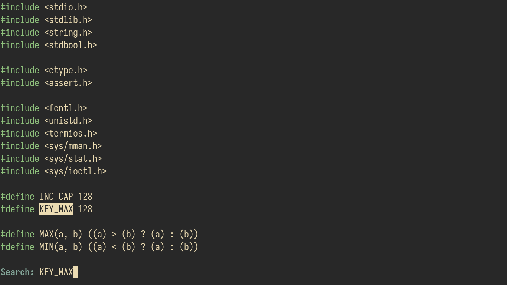

# Meno


A WIP Text Editor in C

## Quick Start
```console
$ ./build.sh
$ ./meno
$ ./meno src/main.c
```

## Keybindings
| Key | Description |
| --- | ----------- |
| <kbd>C-x C-c</kbd> | Quit Meno |
| <kbd>C-x C-k</kbd> | Delete the current buffer |
| <kbd>C-x C-f</kbd> | Find file |
| <kbd>C-x C-b</kbd> | Switch buffers |
| <kbd>M-q</kbd> | Format buffer |
| <kbd>C-s</kbd> | Search forward |
| <kbd>C-r</kbd> | Search backward |
| <kbd>M-s</kbd> | Jump to the next match of previous search |
| <kbd>M-r</kbd> | Jump to the previous match of previous search |
| <kbd>C-x C-r</kbd> | Search and Replace |
| <kbd>C-x C-s</kbd> | Save the file |
| <kbd>C-v</kbd> | Start a selection at the cursor |
| <kbd>C-f</kbd> | Move the cursor forward by a character |
| <kbd>C-b</kbd> | Move the cursor backward by a character |
| <kbd>M-f</kbd> | Move the cursor forward by a word |
| <kbd>M-b</kbd> | Move the cursor backward by a word |
| <kbd>C-a</kbd> | Move the cursor to the beginning of the line |
| <kbd>C-e</kbd> | Move the cursor to the end of the line |
| <kbd>C-n</kbd> | Move the cursor to the next line |
| <kbd>C-p</kbd> | Move the cursor to the previous line |
| <kbd>M-n</kbd> | Move the cursor to the next paragraph |
| <kbd>M-p</kbd> | Move the cursor to the previous paragraph |
| <kbd>C-d</kbd> | Delete a character to the right of the cursor |
| <kbd>BackSpace</kbd> | Delete a character to the left of the cursor |
| <kbd>M-d</kbd> | Delete a word to the right of the cursor |
| <kbd>M-BackSpace</kbd> | Delete a word to the left of the cursor |
| <kbd>C-k</kbd> | Delete from the cursor to the end of the line |
