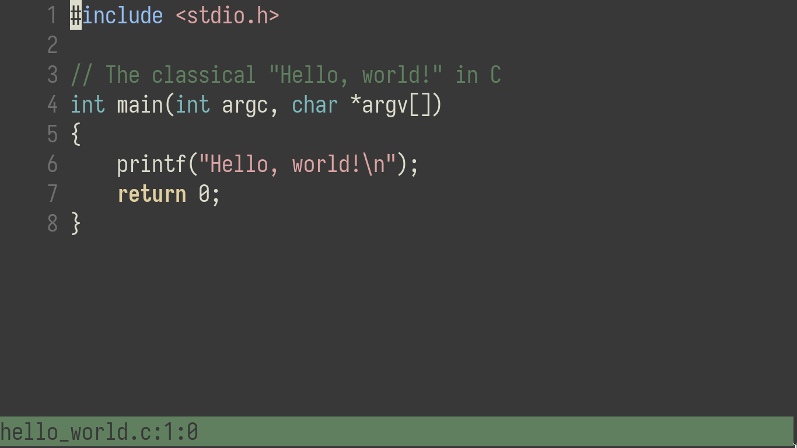

# Text Editor


A WIP text editor in C.

# Installation

```bash
$ git clone https://github.com/shoumodip/keimeno
$ cd keimeno
$ make
```

# Dependencies
- [GNU C library](https://www.gnu.org/software/libc/)
- [Ncurses](https://invisible-island.net/ncurses/)

# Features [4/11]
  - [X] Text manipulations
  - [X] Incremental search
  - [X] Syntax highlighter
  - [X] Indentation system
  - [ ] Configuration system
  - [ ] Macros
  - [ ] Undo system
  - [ ] Count system
  - [ ] Regions
  - [ ] Clipboard
  - [ ] Help system
